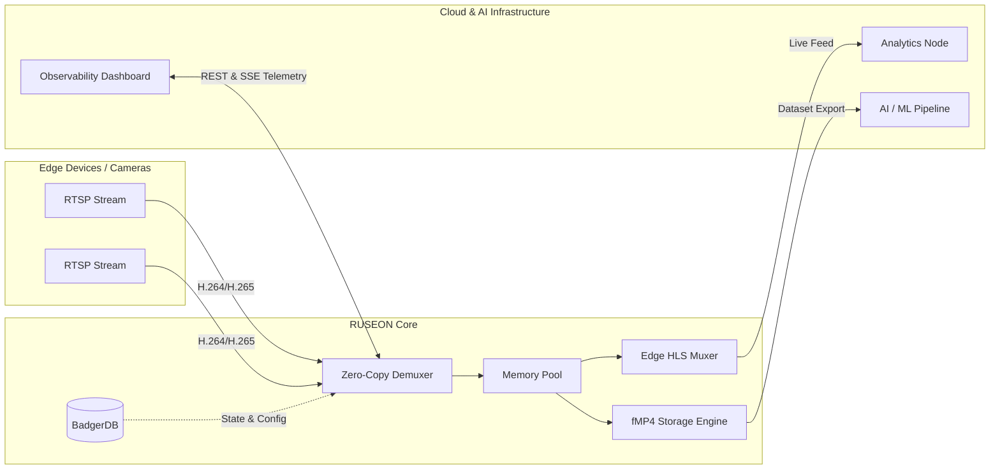

<p align="center">
  
</p>

<h1 align="center">RUSEON Core</h1>

<p align="center">
  <strong>Edge Video Infrastructure & AI Data Pipeline</strong><br>
  <em>Cloud-Native, High-Performance Video Data Platform</em>
</p>

<p align="center">
  <a href="https://github.com/RUSEON/ruseon-core/actions/workflows/ci.yml"></a>
  <a href="https://goreportcard.com/report/github.com/RUSEON/ruseon-core"></a>
  <a href="https://github.com/RUSEON/ruseon-core/releases/latest"></a>
  
  
</p>

<hr>

**RUSEON Core** (Community Edition) is a state-of-the-art Enterprise Video Data Platform engineered in Go. Designed for cloud-native and edge environments, it provides zero-copy RTSP-to-HLS transmuxing, high-performance fMP4 archiving, and a seamless pipeline for AI video analytics.

Built for scale, RUSEON Core delivers massive throughput with minimal resource footprint, making it the ideal foundation for enterprise CCTV networks, smart cities, and AI data pipelines.

## 🚀 Key Features

* ⚡ **Zero-Copy Transmuxing**: Ultra-low latency bridging from RTSP to HLS directly in RAM. Bypasses intermediate transcoding for maximum efficiency.
* 🛡 **Cloud-Native Resilience**: Built-in Thundering Herd protection and robust OOM management to safely handle thousands of concurrent streams.
* 📦 **High-Performance Archiving (fMP4)**: Continuous, gapless recording into fragmented MP4. Optimized for edge storage and rapid cloud synchronization.
* ⏪ **Advanced Timeshift Pipeline**: Real-time HLS playback of historical data, with seamless export capabilities for AI training datasets.
* 🗄 **Embedded NoSQL Engine**: Powered by BadgerDB for sub-millisecond configuration states and metrics, delivering high IOPS without external dependencies.
* 🎨 **Modern Observability UI**: Includes a React 19 (TypeScript) Edge Dashboard with JWT auth, real-time SSE telemetry, and rich timeline visualization.

---

## 🏗 Architecture & AI Data Pipeline

RUSEON Core acts as the critical bridge between edge hardware and your AI / Cloud workloads.



---

## 🏎 Quick Start

### Prerequisites
- [Docker](https://www.docker.com/) (Recommended for rapid deployment)
- [Go](https://go.dev/) 1.23+ (For source builds)

### Deploy via Docker (GHCR) 🐳

The fastest way to deploy RUSEON Core is using our official multi-arch Docker image:

```bash
docker run -d \
  -p 8080:8080 \
  -v ruseon-data:/data \
  --name ruseon-core \
  ghcr.io/ruseon/ruseon-core:latest
```

The Enterprise Edge Dashboard will be available at `http://localhost:8080`.

### Build from Source

For developers and contributors:

```bash
# 1. Clone the repository
git clone https://github.com/RUSEON/ruseon-core.git
cd ruseon-core

# 2. Build the Edge Dashboard (React)
cd web && npm install && npm run build && cd ..

# 3. Start the Core Engine
go mod tidy
go run ./cmd/server
```
*(Default Credentials: admin / admin)*

---

## 🤝 Contributing

We believe in the power of open-source and welcome contributions from the community. 
Whether it's a bug report, new feature, or documentation improvement, please see our [Contributing Guidelines](CONTRIBUTING.md) to get started.

Please ensure your commits follow the [Conventional Commits](https://www.conventionalcommits.org/) specification.

## 📄 License

RUSEON Core (Community Edition) is distributed under the [MIT License](LICENSE). 
