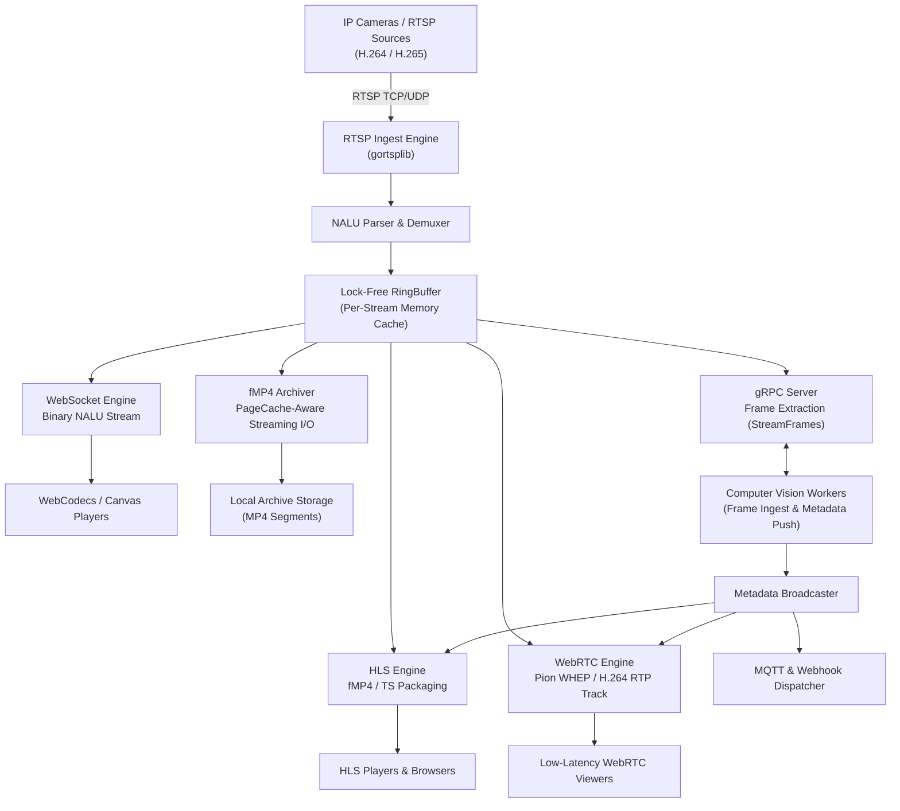

<p align="center">
  
</p>

<h1 align="center">RUSEON Core</h1>

<p align="center">
  <strong>High-Performance Video Infrastructure & AI Media Pipeline</strong><br>
  RTSP Ingest &bull; Lock-Free In-Memory Demuxing &bull; HLS &bull; WebRTC (WHEP) &bull; fMP4 Archive &bull; gRPC AI Streaming
</p>

<p align="center">
  <a href="https://github.com/RUSEGAL/ruseon-core/actions/workflows/test.yml"></a>
  <a href="https://goreportcard.com/report/github.com/RUSEGAL/ruseon-core"></a>
  <a href="https://github.com/RUSEGAL/ruseon-core/releases/latest"></a>
  <a href="bench-results/bench-baseline.md"></a>
  <a href="LICENSE"></a>
</p>

<p align="center">
  <em>Read this in other languages: <a href="README.md">English</a>, <a href="README.ru.md">Русский</a>.</em>
</p>

---

## What is RUSEON?

**RUSEON Core** is an open-source video infrastructure engine built in Go for IP camera fleets, edge compute appliances, and computer vision pipelines. It ingests H.264 and H.265 video streams over RTSP (TCP/UDP) and multiplexes them directly in memory into HLS (fMP4/TS), WebRTC (WHEP), local fMP4 storage archives, and gRPC frame streams without performing server-side video transcoding.

By eliminating video decoding and re-encoding on the server, RUSEON Core operates with predictable CPU utilization and low-overhead playlist generation, serving as a unified bridge between CCTV camera hardware, web clients, and AI inference models.

---

## Why RUSEON?

Traditional media servers either focus strictly on live video rebroadcasting or require CPU-heavy server-side transcoding pipelines. RUSEON Core approaches video as continuous structured data:

* **Transmuxing Pipeline (No Transcoding):** Video packets are parsed at the NALU level and repackaged directly into client-requested container formats (fMP4, TS, RTP) in memory without video decoding or pixel re-encoding.
* **Lock-Free Single-Buffer Distribution:** Ingested frames are written once to a bounded, lock-free ring buffer per stream. Downstream consumers (HLS packager, WebRTC track sender, MP4 recorder, gRPC AI extractors) read concurrently from this buffer without allocating duplicate frame payloads.
* **Slow-Consumer Protection:** Individual reader channels isolate slow clients. If a consumer falls behind, frames are dropped exclusively for that reader without stalling the ingestion engine or affecting other viewers.
* **Page Cache-Managed Streaming I/O:** The local fMP4 archiver optimizes disk writes on Linux using POSIX kernel primitives (`posix_fadvise(FADV_DONTNEED)` and sliding-window `sync_file_range`), preventing continuous video recording writes from evicting the OS Page Cache and causing I/O stalls.
* **Embedded Durable State:** Configuration, camera metadata, and user credentials persist in an embedded BadgerDB key-value store with synchronous write-ahead logging (`SyncWrites = true`), coupled with startup archive recovery routines (`RecoverCrashedFiles`).
* **AI Metadata Synchronization:** Neural network inference results (bounding boxes, telemetry) ingested over gRPC client streams are synchronized with video timelines and pushed to clients via WebRTC DataChannels and HLS WebVTT tracks.
* **Operational Transparency:** Provides native Prometheus metrics, deterministic `/livez` and `/readyz` probes reflecting actual subsystem readiness, and structured JSON telemetry.

---

## Key Capabilities

* **RTSP Ingestion:** Ingests H.264 and H.265 streams over TCP or UDP with connection concurrency throttling and backoff reconnection.
* **HLS Delivery:** Serves low-latency fMP4 and MPEG-TS live playlists with singleflight-cached master playlists and WebVTT metadata tracks.
* **WebRTC / WHEP:** Delivers sub-second interactive H.264 video playback powered by Pion WebRTC over an optional unified UDP port multiplexer.
* **Low-Latency WebCodecs:** Streams raw binary NALUs over WebSocket (`/stream/ws/:id`) for client-side hardware-accelerated Canvas rendering of H.264 and H.265 streams.
* **fMP4 Archiving:** Continuous segmented fragmented MP4 recording with automated retention cleanup and timeline indexing.
* **gRPC AI Streaming:** Exposes server-streaming RPCs for video frame extraction (`StreamFrames`) and client-streaming RPCs for AI metadata ingestion (`PushMetadata`).
* **Event Integration:** Dispatches outbound HTTP webhooks with circuit breakers and publishes AI metadata to MQTT brokers via bounded queues.
* **Embedded UI:** Includes an embedded dashboard (React 19, TypeScript) for stream visualization, camera management, and archive timeline playback.
* **Authentication & RBAC:** Enforces JWT-based access control with role differentiation (Admin, Operator, Viewer, Service) for REST API and media stream endpoints.

---

## Architecture

In RUSEON Core, inbound RTSP packets pass through demuxing and enter an isolated in-memory `RingBuffer`. Independent workers pull from the buffer concurrently to serve connected protocols and storage targets.



For complete technical specifications, see [Architecture & System Design](https://docs.ruseon.tech/architecture/system).

---

## Performance & Stress Benchmarks

The following baseline metrics reflect an uninterrupted **8-hour continuous soak test** executing under high concurrency on a 12-core host.

### Reproducible Baseline (8-Hour Continuous Run)

| Subsystem | Metric | Measured Value | Operational Characteristics |
| :--- | :--- | :--- | :--- |
| **Ingest Throughput** | Total Video FPS | **18,180.4 FPS** (1,342.9 Mbps) | 600 concurrent cameras @ 30 FPS, `0` dropped frames (523.6M frames processed) |
| **HLS Delivery** | Delivered Segments | **501.9 MB/s** (17,625,404 segments) | 1,800 active viewers, `15.1 TB` transferred (`p50: 3.59 ms`, `p95: 211.2 ms`) |
| **REST API Engine** | Request Throughput | **459.9 RPS** (13,244,819 requests) | 10 workers, 100% OK (`0` errors, `p50: 0.59 ms`, `p95: 8.52 ms`, `p99: 28.74 ms`) |
| **WebRTC (WHEP)** | RTP Packet Stream | **2,439,152 packets** (2.83 GB transferred) | 240 concurrent peer connections, `0` session errors (`p50: 390.3 ms` handshake) |
| **gRPC AI Stream** | Frame & Meta Delivery | **18,180.4 FPS** / **1,993.2 RPS** | 20 AI workers, 523.6M frames streamed (`p50: 28.45 ms` delivery latency) |
| **EventBus** | Webhook Dispatch | **11,042,761 events** | `0` dropped events observed during this benchmark |
| **System Memory** | Process Footprint | **707 MB RSS** (95 MB Heap Alloc) | 348 active goroutines at teardown (deterministic worker cleanup) |
| **Garbage Collection** | Runtime Pause | **1.03 ms avg pause** (7.69 ms peak) | 154,969 GC cycles across 8 hours under 500+ MB/s network throughput |

### Benchmark Methodology & Scope

* **Host Configuration:** 12-Core host (`num_cpu: 12`, x86_64 architecture).
* **Test Duration:** 28,800.12 seconds (8.0 continuous hours).
* **Workload Composition:** 600 synthetic RTSP camera sources (720p @ 30 FPS, 2.24 Mbps per stream, GOP = 30), 1,800 HLS fMP4 players, 240 WebRTC WHEP peer connections, 20 gRPC AI stream consumers, 10 concurrent REST API workers.
* **Storage Mode Note:** The soak test ran with simulated/in-memory disk storage (`real_disk: false`) to isolate and measure CPU, RAM, network throughput, and transmuxing performance independently of physical disk array I/O limits.
* **Co-Location Notice:** The synthetic load generator client (`cmd/loadtest`) and the RUSEON Core server ran co-located on the same 12-core host over loopback (`127.0.0.1`), actively competing for OS scheduler slices, memory bandwidth, and kernel networking stack throughout the benchmark.

👉 **[Read the Full Benchmark Report & Raw Datasets](bench-results/bench-baseline.md)**

---

## Quick Start

### 1. Run with Docker

Launch RUSEON Core in a container with persistent storage volumes:

```bash
docker run -d \
  --name ruseon-core \
  -p 8080:8080 \
  -p 8555:8555/udp \
  -p 50051:50051 \
  -v ruseon_data:/app/data \
  -v ruseon_recordings:/app/recordings \
  ghcr.io/rusegal/ruseon-core:latest
```

On first startup, RUSEON Core automatically initializes the database, generates a secure initial administrator password, and logs it to `stdout`:

```bash
docker logs ruseon-core | grep "INITIAL ADMIN PASSWORD"
```

### 2. Access the Dashboard

Navigate to `http://localhost:8080` in your browser. Log in with:
* **Username:** `admin`
* **Password:** *(Generated password from container logs)*

### 3. Add a Camera via REST API

You can add and manage camera streams dynamically without restarting the server:

```bash
# 1. Obtain JWT access token
TOKEN=$(curl -s -X POST http://localhost:8080/api/login \
  -H "Content-Type: application/json" \
  -d '{"username":"admin","password":"YOUR_ADMIN_PASSWORD"}' | jq -r .token)

# 2. Register RTSP camera stream
curl -X POST http://localhost:8080/api/cameras \
  -H "Authorization: Bearer $TOKEN" \
  -H "Content-Type: application/json" \
  -d '{
    "id": "cam-front-door",
    "url": "rtsp://camera.local:554/live/ch0",
    "record": true,
    "retention_days": 7
  }'
```

---

## System Requirements

* **Production Target:** Linux (`amd64` / `arm64`), Kernel $\ge$ 5.4 recommended for optimal `sync_file_range` and `fadvise` I/O.
* **Development & Testing:** macOS and Windows supported via standard file I/O fallback drivers.
* **Runtime:** Docker $\ge$ 20.10, or native binary compiled with Go $\ge$ 1.24.
* **Network Ports:**
  * `8080/tcp` — HTTP REST API, HLS streaming, WHEP signaling, WebCodecs WebSocket, Web UI, Metrics.
  * `8555/udp` — WebRTC Pion UDP media multiplexer (configured via `server.webrtc.listen_port`; when unset, Pion allocates dynamic UDP ports for ICE candidates).
  * `50051/tcp` — gRPC AI streaming interface (configured via `server.grpc.port`).
* **Storage:** Dedicated SSD/NVMe or high-throughput block storage recommended when recording 50+ concurrent streams.

---

## Production Deployment

When deploying RUSEON Core in production environments, ensure the following best practices:

* **Storage Volumes:** Mount `/app/data` to a persistent, durable volume (stores BadgerDB state). Mount `/app/recordings` to a high-capacity filesystem configured for sequential video writes.
* **WebRTC Networking:** Configure `server.webrtc.nat_1_to_1_ips` with your public or load-balancer IP address, and ensure UDP port `8555` is reachable without symmetric NAT alterations.
* **TLS & Reverse Proxy:** Terminate TLS (HTTPS) via a reverse proxy (e.g., NGINX, Envoy, Traefik) or configure native TLS in `config.yaml`. Secure Context (`https://`) is required by modern web browsers to initialize WebRTC streams.

For full configuration reference and deployment guidelines, see the [Deployment Guide](https://docs.ruseon.tech/deployment/overview).

---

## Observability & Operations

RUSEON Core exposes standard operational endpoints for monitoring and orchestration:

* **Liveness Probe (`GET /livez`):** Verifies that the internal HTTP engine is active and responsive.
* **Readiness Probe (`GET /readyz`):** Executes real-time health checks against the BadgerDB state store, storage volume writability, and stream manager initialization. Returns `503 Service Unavailable` if core components fail.
* **Prometheus Metrics (`GET /metrics`):** Exports standard runtime telemetry, stream bitrates, active viewer sessions, dropped packet counts, and storage I/O stats.
* **Runtime Profiling (`GET /debug/pprof/*`):** Standard Go execution profiling (gated behind `server.pprof_port` configuration).

---

## Security Model

* **Authentication:** REST API and media stream endpoints require cryptographically signed HS256 JWT tokens.
* **Credential Protection:** User passwords are encrypted with bcrypt before persisting to BadgerDB.
* **Token Scope Differentiation:** Ephemeral stream playback tokens (`?token=`) contain a `stream_id` claim and are strictly prevented from accessing management REST API endpoints.
* **Role-Based Access Control (RBAC):** API endpoints enforce role checks (`Admin`, `Operator`, `Viewer`, `Service`) via middleware.
* **Automated Static Audits:** Continuous integration pipeline enforces zero warnings on `golangci-lint` and automated SAST scans via `gosec`.

For vulnerability disclosure instructions, see [SECURITY.md](SECURITY.md).

---

## Compatibility & Supported Standards

| Protocol / Component | Ingest / Source Support | Output / Client Support | Notes |
| :--- | :--- | :--- | :--- |
| **RTSP** | H.264, H.265 (TCP / UDP) | — | Client connection concurrency throttled |
| **HLS** | — | fMP4, MPEG-TS | H.264 / H.265 passthrough; client/browser codec support applies |
| **WebRTC (WHEP)** | — | H.264 (`webrtc.MimeTypeH264`) | Sub-second live delivery via Pion WebRTC |
| **WebSocket** | — | Binary NALU stream | WebCodecs / client-side canvas player (H.264 & H.265) |
| **Archive Storage** | — | Fragmented MP4 (fMP4) | Local filesystem with POSIX cache management |
| **AI Integration** | `PushMetadata` (gRPC) | `StreamFrames` (gRPC) | Server-streaming video frames & client-streaming metadata |
| **Telemetry & Events** | — | MQTT v3.1.1 / v5.0, Webhooks | Bounded async queues with circuit breaker |
| **State Storage** | — | BadgerDB v4 | Pure Go LSM-tree with WAL (`SyncWrites = true`) |

---

## Documentation

The official documentation is maintained at **[docs.ruseon.tech](https://docs.ruseon.tech/)**:

* [Getting Started Guide](https://docs.ruseon.tech/guide/introduction)
* [Configuration Reference](https://docs.ruseon.tech/reference/configuration)
* [Architecture & Data Flow](https://docs.ruseon.tech/architecture/overview)
* [Streaming & WebRTC Setup](https://docs.ruseon.tech/streaming/overview)
* [Archive & Smart I/O Engine](https://docs.ruseon.tech/archive/overview)
* [REST API Specification](https://docs.ruseon.tech/api/overview)
* [Production Deployment](https://docs.ruseon.tech/deployment/overview)
* [Troubleshooting & Diagnostics](https://docs.ruseon.tech/troubleshooting/overview)

---

## Known Limitations

* **No Server-Side Video Transcoding:** RUSEON Core operates strictly via transmuxing. It does not decode or transcode video. If source cameras publish in codecs not supported by legacy client browsers (e.g., H.265 on older mobile devices), playback relies on client-side WebCodecs / Canvas rendering or requires an upstream transcoder.
* **WebRTC Output Codec:** WebRTC WHEP output currently packages H.264 video tracks. Streams ingested as H.265 can be played via HLS, WebSocket/WebCodecs, or archived to fMP4, but require H.264 source streams for WebRTC WHEP playback.
* **Local Storage Scope:** The Community Edition manages local storage arrays directly attached to the host. Storage interfaces (`BlobStore`, `StateStore`) provide abstraction boundaries for future distributed backends.
* **Bounded Metadata Queueing:** AI metadata and MQTT publishing queues are bounded. If external consumers or brokers stall, overloaded queues drop new metadata to prevent blocking real-time media distribution.

See [Known Limitations](https://docs.ruseon.tech/reference/known-limitations) for further technical considerations.

---

## Project Status & Commercial Support

RUSEON Core Community Edition is an open-source project available under the MIT License.

The architecture defines interfaces (such as `BlobStore` and `StateStore`) designed to accommodate additional storage, authentication, and high-availability backends. Commercial extensions and enterprise deployments are developed separately.

> For commercial inquiries, custom deployments, and enterprise support: [rusegal.dev@yahoo.com](mailto:rusegal.dev@yahoo.com)

---

## Contributing

We welcome community contributions. To get started:

1. Review [CONTRIBUTING.md](CONTRIBUTING.md) for coding conventions and branch workflows (`dev` branch).
2. Adhere to the [Contributor Code of Conduct](CODE_OF_CONDUCT.md).
3. Ensure all changes pass unit tests, fuzz tests, and linters:
   ```bash
   go test -v -race ./...
   golangci-lint run ./...
   ```

---

## License

RUSEON Core (Community Edition) is licensed under the [MIT License](LICENSE).
