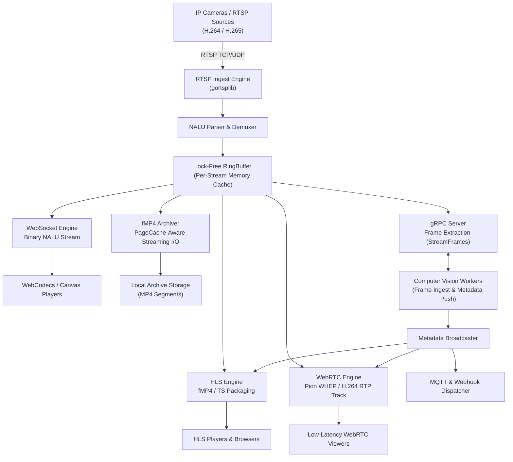

<p align="center">
  
</p>

<h1 align="center">RUSEON Core</h1>

<p align="center">
  <strong>High-Performance Video Infrastructure & AI Media Pipeline Engine</strong><br>
  Open-Source Media Server &bull; RTSP Gateway &bull; WebRTC (WHEP) &bull; fMP4 Archive &bull; NVR/VMS Backend &bull; gRPC AI Streaming
</p>

<p align="center">
  <a href="https://github.com/RUSEGAL/ruseon-core/actions/workflows/test.yml"></a>
  <a href="https://goreportcard.com/report/github.com/RUSEGAL/ruseon-core"></a>
  <a href="https://github.com/RUSEGAL/ruseon-core/releases/latest"></a>
  <a href="bench-results/bench-baseline.md"></a>
  <a href="LICENSE"></a>
</p>

<p align="center">
  <em>Read this in other languages: <a href="README.md">English</a>, <a href="README.ru.md">Русский</a>.</em>
</p>

---

## What is RUSEON?

**RUSEON Core** is an open-source, high-performance video infrastructure engine and media server written in Go, designed for IP camera fleets, CCTV recording systems, edge appliances, and computer vision pipelines.

It serves as a unified, lightweight streaming backend: ingesting H.264 and H.265 video streams from IP cameras over RTSP (TCP/UDP) and multiplexing them directly in memory into low-latency WebRTC (WHEP), HLS (fMP4/TS), WebSocket (WebCodecs Canvas), continuous local fMP4 storage archives, and high-throughput gRPC video frame streams for real-time AI inference.

### Who is it for?
* **Video & Media Infrastructure Engineers:** Building scalable, low-latency live streaming, RTSP proxying, and camera restreaming services.
* **VMS & NVR Developers:** Creating self-hosted or cloud-native video surveillance platforms, CCTV recording backends, and multi-camera management solutions.
* **Computer Vision & AI Teams:** Deploying real-time video analytics, object detection, and neural network inference pipelines requiring low-overhead frame extraction.
* **Edge & IoT Architects:** Deploying private, on-premise video processing nodes and embedded Linux media servers with strict CPU and memory constraints.

### How does it differ from traditional Media Servers and NVRs?
Traditional media servers often treat video either as broadcast-only streams or rely on CPU-heavy server-side video transcoding pipelines that limit stream density. Traditional NVRs, on the other hand, couple user interfaces, storage, and video processing into monolithic systems that struggle with high camera counts or Linux disk cache exhaustion. 

RUSEON Core operates strictly via **zero-transcoding transmuxing** and **lock-free single-buffer distribution**, operating as an unopinionated, high-density infrastructure engine that bridges IP camera hardware with modern web browsers, storage disks, and AI inference runtimes.

---

## Why RUSEON?

* **Transmuxing Pipeline (Zero-Transcoding Architecture):** Video packets are parsed at the NALU level and repackaged directly into client-requested container formats (fMP4, TS, RTP) in memory without CPU-heavy video decoding or pixel re-encoding.
* **Lock-Free Single-Buffer Distribution:** Ingested frames are written once to a bounded, lock-free ring buffer per stream. Downstream consumers (HLS packager, WebRTC track sender, fMP4 recorder, gRPC AI frame extractors) read concurrently from this buffer without allocating duplicate frame payloads in RAM.
* **Slow-Consumer Isolation:** Individual reader channels isolate slow clients and network drops. If a consumer falls behind, frames are dropped exclusively for that reader without stalling the ingestion engine, affecting live CCTV viewers, or delaying recording.
* **Page Cache-Aware Storage & 24/7 Archiving:** The local fMP4 recording archiver optimizes disk writes on Linux using POSIX kernel primitives (`posix_fadvise(FADV_DONTNEED)` and sliding-window `sync_file_range`), preventing continuous video surveillance recording from evicting the OS Page Cache and causing memory bloat or I/O stalls.
* **Crash-Proof Self-Indexed fMP4 Storage:** Video archives are stored as standalone fragmented MP4 chunks (`moof` + `mdat`) with sidecar keyframe indices (`.idx`). Unfinished recordings remain fully playable after power outages without requiring file repair utilities.
* **Embedded Durable State Store:** Configuration, camera metadata, folders, tags, and user credentials persist in an embedded BadgerDB LSM-tree key-value store with synchronous write-ahead logging (`SyncWrites = true`), coupled with startup archive recovery routines (`RecoverCrashedFiles`).
* **Real-Time AI Inference & Metadata Synchronization:** Video frames extracted via server-streaming gRPC feed external computer vision workers (YOLO, custom inference services), while incoming detection metadata (bounding boxes, telemetry) ingested over client-streaming gRPC is synchronized with video timelines and pushed to clients via WebRTC DataChannels, HLS WebVTT tracks, MQTT brokers, and Webhooks.
* **Operational Transparency & Observability:** Native Prometheus metrics, deterministic `/livez` and `/readyz` probes reflecting actual subsystem readiness, and structured JSON telemetry.

---

## Use Cases

* **Self-Hosted NVR & VMS Backend:** Acts as the high-density video ingestion, 24/7 continuous fMP4 recording, and timeline indexing backend for custom video surveillance and CCTV management platforms.
* **IP Camera RTSP to WebRTC Gateway:** Ingests RTSP streams from multi-camera installations and delivers sub-second, low-latency live video directly to web browsers via WebRTC (WHEP) and WebCodecs (WebSocket).
* **Edge Video Infrastructure & Analytics:** Functions as a lightweight, on-premise media server for edge compute appliances and industrial Linux devices with predictable CPU and memory footprints.
* **Real-Time AI & Computer Vision Pipelines:** Delivers high-throughput gRPC frame extraction (`StreamFrames`) to external neural network inference workers (e.g., YOLO, TensorRT, PyTorch) and synchronizes detection metadata back to clients.
* **CCTV Video Archive & Timeline Scrubbing:** Stores continuous, crash-resilient fragmented MP4 video with automated retention cleanup, sidecar keyframe index seeking, and virtual HLS archive playback without duplicating files.
* **Multi-Protocol Camera Restreaming:** Restreams camera feeds concurrently across HLS, WebRTC, and WebSocket subscribers, while publishing event notifications to MQTT brokers and Webhook endpoints.

---

## Key Capabilities

* **High-Density RTSP Ingestion:** Ingests H.264 and H.265 streams over TCP or UDP with connection concurrency throttling, keep-alive management, and backoff reconnection.
* **Sub-Second WebRTC (WHEP) Streaming:** Delivers ultra-low-latency H.264 video playback powered by Pion WebRTC over an optional unified UDP port multiplexer with `sendmmsg` batching.
* **HLS Live & Archive Delivery:** Serves low-latency fMP4 and MPEG-TS live playlists with singleflight-cached master playlists and synchronized WebVTT metadata tracks.
* **Low-Latency WebCodecs & WebSocket:** Streams raw binary NALUs over WebSocket (`/stream/ws/:id`) for client-side hardware-accelerated Canvas rendering of H.264 and H.265 streams.
* **fMP4 Archiving & Retention Engine:** Continuous segmented fragmented MP4 recording with Linux kernel Page Cache eviction, automated retention cleanup, and timeline scrubbing via `.idx` sidecar files.
* **gRPC AI Video & Metadata Pipeline:** Exposes server-streaming RPCs for video frame extraction (`StreamFrames`) and client-streaming RPCs for real-time AI metadata ingestion (`PushMetadata`).
* **IoT & Event Dispatching:** Publishes AI detection events and camera telemetry to MQTT brokers (v3.1.1/v5.0) and dispatches outbound HTTP webhooks with circuit breaker protection.
* **Embedded Web UI & Camera Management:** Integrated dashboard (React 19, TypeScript) for live multi-camera viewing, stream configuration, tag management, and archive timeline playback.
* **Authentication & RBAC:** Enforces JWT-based access control with granular roles (`Admin`, `Operator`, `Viewer`, `Service`) and separate scoped stream tokens for REST API and media endpoints.

---

## Architecture

In RUSEON Core, inbound RTSP packets pass through demuxing and enter an isolated in-memory `RingBuffer`. Independent workers pull from the buffer concurrently to serve connected protocols, storage targets, and AI consumers.



### AI Inference & Metadata Data Flow

```text
RTSP Camera Stream
  ↓
RUSEON RTSP Ingest
  ↓
NALU Parsing & RingBuffer
  ↓
gRPC Frame Streaming (StreamFrames)
  ↓
External AI / Computer Vision Worker (YOLO / TensorRT)
  ↓
gRPC Metadata Ingestion (PushMetadata)
  ↓
Metadata Broadcaster
  ↓
WebRTC DataChannels  |  HLS WebVTT  |  MQTT Events  |  HTTP Webhooks
```

For complete technical specifications, see [Architecture & System Design](https://docs.ruseon.tech/architecture/system).

---

## Performance & Stress Benchmarks

The following baseline metrics reflect an uninterrupted **8-hour continuous soak test** executing under high concurrency on a 12-core host.

### Reproducible Baseline (8-Hour Continuous Run)

| Subsystem | Metric | Measured Value | Operational Characteristics |
| :--- | :--- | :--- | :--- |
| **Ingest Throughput** | Total Video FPS | **18,180.4 FPS** (1,342.9 Mbps) | 600 concurrent cameras @ 30 FPS, `0` dropped frames (523.6M frames processed) |
| **HLS Delivery** | Delivered Segments | **501.9 MB/s** (17,625,404 segments) | 1,800 active viewers, `15.1 TB` transferred (`p50: 3.59 ms`, `p95: 211.2 ms`) |
| **REST API Engine** | Request Throughput | **459.9 RPS** (13,244,819 requests) | 10 workers, 100% OK (`0` errors, `p50: 0.59 ms`, `p95: 8.52 ms`, `p99: 28.74 ms`) |
| **WebRTC (WHEP)** | RTP Packet Stream | **2,439,152 packets** (2.83 GB transferred) | 240 concurrent peer connections, `0` session errors (`p50: 390.3 ms` handshake) |
| **gRPC AI Stream** | Frame & Meta Delivery | **18,180.4 FPS** / **1,993.2 RPS** | 20 AI workers, 523.6M frames streamed (`p50: 28.45 ms` delivery latency) |
| **EventBus** | Webhook Dispatch | **11,042,761 events** | `0` dropped events observed during this benchmark |
| **System Memory** | Process Footprint | **707 MB RSS** (95 MB Heap Alloc) | 348 active goroutines at teardown (deterministic worker cleanup) |
| **Garbage Collection** | Runtime Pause | **1.03 ms avg pause** (7.69 ms peak) | 154,969 GC cycles across 8 hours under 500+ MB/s network throughput |

### Benchmark Methodology & Scope

* **Host Configuration:** 12-Core host (`num_cpu: 12`, x86_64 architecture).
* **Test Duration:** 28,800.12 seconds (8.0 continuous hours).
* **Workload Composition:** 600 synthetic RTSP camera sources (720p @ 30 FPS, 2.24 Mbps per stream, GOP = 30), 1,800 HLS fMP4 players, 240 WebRTC WHEP peer connections, 20 gRPC AI stream consumers, 10 concurrent REST API workers.
* **Storage Mode Note:** The soak test ran with simulated/in-memory disk storage (`real_disk: false`) to isolate and measure CPU, RAM, network throughput, and transmuxing performance independently of physical disk array I/O limits.
* **Co-Location Notice:** The synthetic load generator client (`cmd/loadtest`) and the RUSEON Core server ran co-located on the same 12-core host over loopback (`127.0.0.1`), actively competing for OS scheduler slices, memory bandwidth, and kernel networking stack throughout the benchmark.

👉 **[Read the Full Benchmark Report & Raw Datasets](bench-results/bench-baseline.md)**

---

## Quick Start

### 1. Run with Docker

Launch RUSEON Core in a container with persistent storage volumes (available on Docker Hub and GitHub Container Registry):

```bash
cp config.example.yaml config.yaml
# From Docker Hub:
docker run -d \
  --name ruseon-core \
  -p 8080:8080 \
  -p 8555:8555/udp \
  -p 50051:50051 \
  -v ruseon_data:/app/data \
  -v ruseon_recordings:/app/recordings \
  rusegal/ruseon-core:latest

# Or from GitHub Container Registry (GHCR):
# docker run -d ... ghcr.io/rusegal/ruseon-core:latest
```

On first startup, RUSEON Core automatically initializes the database, generates a secure initial administrator password, and logs it to `stdout`:

```bash
docker logs ruseon-core | grep "INITIAL ADMIN PASSWORD"
```

### 2. Access the Dashboard

Navigate to `http://localhost:8080` in your browser. Log in with:
* **Username:** `admin`
* **Password:** *(Generated password from container logs)*

### 3. Add an IP Camera via REST API

You can register and configure camera streams dynamically at runtime without restarting the server:

```bash
# 1. Obtain JWT access token
TOKEN=$(curl -s -X POST http://localhost:8080/api/login \
  -H "Content-Type: application/json" \
  -d '{"username":"admin","password":"YOUR_ADMIN_PASSWORD"}' | jq -r .token)

# 2. Register RTSP camera stream
curl -X POST http://localhost:8080/api/cameras \
  -H "Authorization: Bearer $TOKEN" \
  -H "Content-Type: application/json" \
  -d '{
    "id": "cam-front-door",
    "url": "rtsp://camera.local:554/live/ch0",
    "record": true,
    "retention_days": 7
  }'
```

---

## System Requirements

* **Production Target:** Linux (`amd64` / `arm64`), Kernel $\ge$ 5.4 recommended for optimal `sync_file_range` and `fadvise` I/O.
* **Development & Testing:** macOS and Windows supported via standard file I/O fallback drivers.
* **Runtime:** Docker $\ge$ 20.10, or native binary compiled with Go $\ge$ 1.24.
* **Network Ports:**
  * `8080/tcp` — HTTP REST API, HLS streaming, WHEP signaling, WebCodecs WebSocket, Web UI, Metrics.
  * `8555/udp` — WebRTC Pion UDP media multiplexer (configured via `server.webrtc.listen_port`; when unset, Pion allocates dynamic UDP ports for ICE candidates).
  * `50051/tcp` — gRPC AI streaming interface (configured via `server.grpc.port`).
* **Storage:** Dedicated SSD/NVMe or high-throughput block storage recommended when recording 50+ concurrent streams.

---

## Production Deployment

When deploying RUSEON Core in production environments, ensure the following best practices:

* **Storage Volumes:** Mount `/app/data` to a persistent, durable volume (stores BadgerDB state). Mount `/app/recordings` to a high-capacity filesystem configured for sequential video writes.
* **WebRTC Networking:** Configure `server.webrtc.nat_1_to_1_ips` with your public or load-balancer IP address, and ensure UDP port `8555` is reachable without symmetric NAT alterations.
* **TLS & Reverse Proxy:** Terminate TLS (HTTPS) via a reverse proxy (e.g., NGINX, Envoy, Traefik) or configure native TLS in `config.yaml`. Secure Context (`https://`) is required by modern web browsers to initialize WebRTC streams.

For full configuration reference and deployment guidelines, see the [Deployment Guide](https://docs.ruseon.tech/deployment/overview).

---

## Observability & Operations

RUSEON Core exposes standard operational endpoints for monitoring and orchestration:

* **Liveness Probe (`GET /livez`):** Verifies that the internal HTTP engine is active and responsive.
* **Readiness Probe (`GET /readyz`):** Executes real-time health checks against the BadgerDB state store, storage volume writability, and stream manager initialization. Returns `503 Service Unavailable` if core components fail.
* **Prometheus Metrics (`GET /metrics`):** Exports standard runtime telemetry, stream bitrates, active viewer sessions, dropped packet counts, and storage I/O stats.
* **Runtime Profiling (`GET /debug/pprof/*`):** Standard Go execution profiling (gated behind `server.pprof_port` configuration).

---

## Security Model

* **Authentication:** REST API and media stream endpoints require cryptographically signed HS256 JWT tokens.
* **Credential Protection:** User passwords are encrypted with bcrypt before persisting to BadgerDB.
* **Token Scope Differentiation:** Ephemeral stream playback tokens (`?token=`) contain a `stream_id` claim and are strictly prevented from accessing management REST API endpoints.
* **Role-Based Access Control (RBAC):** API endpoints enforce role checks (`Admin`, `Operator`, `Viewer`, `Service`) via middleware.
* **Automated Static Audits:** Continuous integration pipeline enforces zero warnings on `golangci-lint` and automated SAST scans via `gosec`.

For vulnerability disclosure instructions, see [SECURITY.md](SECURITY.md).

---

## Compatibility & Supported Standards

| Protocol / Component | Ingest / Source Support | Output / Client Support | Notes |
| :--- | :--- | :--- | :--- |
| **RTSP** | H.264, H.265 (TCP / UDP) | — | Client connection concurrency throttled |
| **HLS** | — | fMP4, MPEG-TS | H.264 / H.265 passthrough; client/browser codec support applies |
| **WebRTC (WHEP)** | — | H.264 (`webrtc.MimeTypeH264`) | Sub-second live delivery via Pion WebRTC |
| **WebSocket** | — | Binary NALU stream | WebCodecs / client-side canvas player (H.264 & H.265) |
| **Archive Storage** | — | Fragmented MP4 (fMP4) | Local filesystem with POSIX cache management |
| **AI Integration** | `PushMetadata` (gRPC) | `StreamFrames` (gRPC) | Server-streaming video frames & client-streaming metadata |
| **Telemetry & Events** | — | MQTT v3.1.1 / v5.0, Webhooks | Bounded async queues with circuit breaker |
| **State Storage** | — | BadgerDB v4 | Pure Go LSM-tree with WAL (`SyncWrites = true`) |

---

## Documentation

The official documentation is maintained at **[docs.ruseon.tech](https://docs.ruseon.tech/)**:

* [Getting Started Guide](https://docs.ruseon.tech/guide/introduction)
* [Configuration Reference](https://docs.ruseon.tech/reference/configuration)
* [Architecture & Data Flow](https://docs.ruseon.tech/architecture/overview)
* [Streaming & WebRTC Setup](https://docs.ruseon.tech/streaming/overview)
* [Archive & Smart I/O Engine](https://docs.ruseon.tech/archive/overview)
* [REST API Specification](https://docs.ruseon.tech/api/overview)
* [Production Deployment](https://docs.ruseon.tech/deployment/overview)
* [Troubleshooting & Diagnostics](https://docs.ruseon.tech/troubleshooting/overview)

---

## Known Limitations

* **No Server-Side Video Transcoding:** RUSEON Core operates strictly via transmuxing. It does not decode or transcode video. If source cameras publish in codecs not supported by legacy client browsers (e.g., H.265 on older mobile devices), playback relies on client-side WebCodecs / Canvas rendering or requires an upstream transcoder.
* **WebRTC Output Codec:** WebRTC WHEP output currently packages H.264 video tracks. Streams ingested as H.265 can be played via HLS, WebSocket/WebCodecs, or archived to fMP4, but require H.264 source streams for WebRTC WHEP playback.
* **Local Storage Scope:** The Community Edition manages local storage arrays directly attached to the host. Storage interfaces (`BlobStore`, `StateStore`) provide abstraction boundaries for future distributed backends.
* **Bounded Metadata Queueing:** AI metadata and MQTT publishing queues are bounded. If external consumers or brokers stall, overloaded queues drop new metadata to prevent blocking real-time media distribution.

See [Known Limitations](https://docs.ruseon.tech/reference/known-limitations) for further technical considerations.

---

## Project Status & Commercial Support

RUSEON Core Community Edition is an open-source project available under the MIT License.

The architecture defines interfaces (such as `BlobStore` and `StateStore`) designed to accommodate additional storage, authentication, and high-availability backends. Commercial extensions and enterprise deployments are developed separately.

> For commercial inquiries, custom deployments, and enterprise support: [rusegal.dev@yahoo.com](mailto:rusegal.dev@yahoo.com)

---

## Contributing

We welcome community contributions. To get started:

1. Review [CONTRIBUTING.md](CONTRIBUTING.md) for coding conventions and branch workflows (`dev` branch).
2. Adhere to the [Contributor Code of Conduct](CODE_OF_CONDUCT.md).
3. Ensure all changes pass unit tests, fuzz tests, and linters:
   ```bash
   go test -v -race ./...
   golangci-lint run ./...
   ```

---

## License

RUSEON Core (Community Edition) is licensed under the [MIT License](LICENSE).

