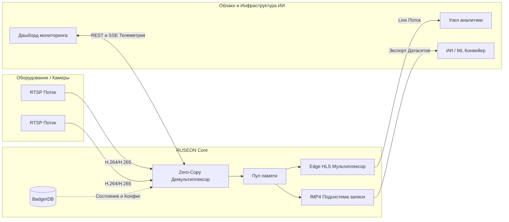

<p align="center">
  
</p>

<h1 align="center">RUSEON Core</h1>

<p align="center">
  <strong>Edge Video Infrastructure & AI Data Pipeline</strong><br>
  <em>Облачно-ориентированная, высокопроизводительная платформа для видеоданных</em>
</p>

<p align="center">
  <a href="https://github.com/RUSEON/ruseon-core/actions/workflows/ci.yml"></a>
  <a href="https://goreportcard.com/report/github.com/RUSEON/ruseon-core"></a>
  <a href="https://github.com/RUSEON/ruseon-core/releases/latest"></a>
  
  
</p>

<p align="center">
  <em>Читать на других языках: <a href="README.md">English</a>, <a href="README.ru.md">Русский</a>.</em>
</p>

<hr>

<p align="center">
  <em>Большинство open-source видеосерверов решают задачу стриминга.<br>RUSEON решает задачу полного жизненного цикла видеоданных.<br>Ingest. Route. Record. Analyze. Export.<br>Один движок.</em>
</p>

**RUSEON Core** — это open-source Edge-платформа для работы с видеоинфраструктурой, написанная на Go. Разработанная для облачных и Edge-сред, она обеспечивает zero-copy ретрансляцию RTSP в HLS/WebRTC, запись архива в fMP4 и закладывает фундаментальный API для систем видеоаналитики на базе ИИ.

Вместо того чтобы пытаться делать всё подряд (например, ИИ-инференс или GPU-перекодирование) внутри одного монолита, RUSEON фокусируется исключительно на максимально эффективной маршрутизации и хранении байтов видео. Он спроектирован как центральный роутер и хранилище, в то время как тяжелые аналитические задачи (YOLO, распознавание лиц) работают как отдельные модули (например, `ruseon-yolo`, `ruseon-lpr`).

## 🚀 Ключевые возможности

* ⚡ **Zero-Copy Ретрансляция**: Сверхнизкая задержка при преобразовании RTSP в HLS/WebRTC напрямую в оперативной памяти. Обходит промежуточное перекодирование для максимальной эффективности.
* 🎥 **Ultra-Low Latency (WebRTC WHEP)**: Поддержка протокола WebRTC для воспроизведения с около-нулевой задержкой, что критически важно для PTZ-камер и real-time аналитики.
* 🧠 **Zero-Transcoding AI Metadata**: Проброс метаданных от нейросетей (Bounding Boxes) напрямую в видеопотоки зрителей через **HLS WebVTT** и **WebRTC DataChannels**, экономя 100% CPU (без ре-энкодинга).
* 💾 **Smart I/O Archiver**: Использование механизмов ядра Linux (`FADV_DONTNEED`, скользящее окно `sync_file_range`) для защиты оперативной памяти (OS Page Cache) от вымывания при записи гигабайтов fMP4 видеоархива. Защищает от I/O stalls.
* 🛡 **Cloud-Native Архитектура и Безопасность**: Встроенная защита от проблемы "Thundering Herd", жесткий OOM-контроль, а также защита API от атак типа Path Traversal (проверено через CodeQL).
* 📦 **Высокопроизводительный архив (fMP4)**: Непрерывная запись без потерь в формат fragmented MP4. Оптимизировано для хранения на Edge-устройствах и быстрой синхронизации с облаком.
* ⏪ **Продвинутый Timeshift-конвейер**: Воспроизведение архивных данных в формате HLS в реальном времени с возможностью бесшовного экспорта датасетов для обучения ИИ.
* 🗄 **Встроенная NoSQL-СУБД**: Работает на базе BadgerDB, обеспечивая субмиллисекундное сохранение конфигураций и метрик без необходимости во внешних зависимостях.
* 🎨 **Современный UI-мониторинг**: Включает Edge-дашборд на React 19 (TypeScript) с JWT-авторизацией, телеметрией SSE в реальном времени и удобной визуализацией таймлайна.

---

## ⚔️ Философия и Сравнение

Философия RUSEON Core сильно отличается от других популярных инструментов в экосистеме видео. Вместо прямой конкуренции, он решает совершенно иную архитектурную задачу:

- **MediaMTX**: Великолепный **Медиа-маршрутизатор**. Фокусируется на трансляции огромного числа протоколов (RTSP, WebRTC, RTMP, SRT). RUSEON, напротив, сфокусирован на **жизненном цикле видеоданных** (архив, timeshift, экспорт датасетов).
- **FFmpeg**: Ультимативный **Медиа-инструментарий**. Идеален для обработки видео, но требует сложного скриптинга для создания надежного демона, управляемого по API.
- **Flussonic**: Комплексная **IPTV-платформа**, созданная для телекома и броадкастинга.
- **RUSEON Core**: Инфраструктурная **Edge-видеоплатформа**. Создана специально для приема потоков с CCTV камер, их надежного сохранения на диск и эффективной раздачи операторам и конвейерам ИИ.

## 🏗 Архитектура и Конвейер Данных ИИ

RUSEON Core выступает в роли критически важного связующего звена между Edge-оборудованием и вашими Облачными/ИИ нагрузками.



---

## 📊 Производительность

RUSEON Core спроектирован для максимальной эффективности. В его основе лежит **Zero-Copy** маршрутизатор, который гарантирует, что CPU и память тратятся только на полезную работу. Архитектура полностью избегает работы сборщика мусора (GC) на горячих путях передачи видеокадров.

**🖥 Тестовый стенд:**
* **CPU:** AMD Ryzen 5 5600X (Все тесты ниже выполнялись на **одном** ядре)
* **ОС / Архитектура:** Windows / amd64
* **Runtime:** Go 1.23+

### 1. Широковещательная рассылка кадров (Zero-Copy RingBuffer)
Ядро получает видеокадр (H.264/H.265) и мгновенно рассылает его подписчикам (HLS Muxer, Recorder, и ИИ агенты) без копирования данных в памяти.

| Операция | Время (ns/op) | Аллокации памяти | Описание |
| :--- | :--- | :--- | :--- |
| `Write` | **13.9 ns** | **0 B/op** (0 allocs) | Запись кадра в буфер |
| `Broadcast (100 subs)` | **10.8 µs** | **0 B/op** (0 allocs) | Рассылка 1 кадра 100 подписчикам одновременно |

> **Итог:** Движок способен маршрутизировать десятки тысяч кадров в секунду на одном ядре CPU, **не выделяя абсолютно никакой новой памяти в куче** (0 allocs/op).

### 2. Edge HLS Доставка (Muxer)
Даже в условиях проблемы *Thundering Herd* (когда тысячи пользователей одновременно подключаются к одной прямой трансляции), RUSEON раздает M3U8 плейлисты и TS сегменты напрямую из кэша в оперативной памяти.

| Операция | Время | Пропускная способность | Описание |
| :--- | :--- | :--- | :--- |
| `GetPlaylist` | **~1.1 µs** | ~1,000,000 req/sec | Генерация M3U8 манифеста |
| `GetSegment (1 MB)` | **~113 µs** | **~8.7 GB/s** | Извлечение TS сегмента (1 МБ) из пула |

> **Итог:** Ваш сервер не упадет во время массовых всплесков трафика. Одно ядро CPU может обрабатывать отдачу сегментов на скорости почти 9 Гигабайт в секунду.

### 3. Высокоскоростной Архив (fMP4 Recorder)
Упаковка видеопотоков в формат fragmented MP4 (fMP4) для записи на постоянное хранилище.

| Операция | Время | Описание |
| :--- | :--- | :--- |
| `Write GOP (1 sec video)` | **~1.58 ms** | Упаковка 25 кадров (1 сек. видео) и сброс на диск |

> **Итог:** Одно ядро CPU может непрерывно архивировать **~630 одновременных видеопотоков**. Производительность RUSEON Core строго упирается в пропускную способность ваших дисков и сети, а не процессора!

### 4. Нагрузочное тестирование HLS (Thundering Herd) 🌩️
Мы провели End-to-End тестирование отдачи HLS (Live) с помощью `k6` (от Grafana). Цель теста: сымитировать одновременное подключение 1000 зрителей к одной трансляции (камере) для проверки работы Zero-Copy кэширования Muxer'а.

**Условия теста:** 1000 одновременных Virtual Users (`k6`), постоянное скачивание `index.m3u8` и новых бинарных `.ts` сегментов на протяжении 70 секунд.

| Метрика | Результат | Описание |
| :--- | :--- | :--- |
| **Пропускная способность** | **1.1 GB/s (8.8 Gbps)** | Раздача 81 Гигабайта видеоданных за ~70 секунд |
| **Успешность (HTTP 200)** | **100%** (60 822 запросов) | Ни одного оборванного соединения (0% fail rate) |
| **Задержка (Latency) avg** | **3.13 ms** | Среднее время отдачи сегмента зрителю |
| **Задержка (Latency) p(95)** | **6.13 ms** | 95% всех зрителей получали кусок быстрее 6 миллисекунд |

> **Итог:** Архитектура спроектирована для минимизации проблемы Thundering Herd и продемонстрировала высокую стабильность в наших бенчмарк-сценариях. RUSEON Core без труда утилизировал локальные сетевые интерфейсы 10G, сохраняя задержку ответа менее 6 миллисекунд для тысяч TCP-соединений.


### 5. Потребление ресурсов при 100 RTSP-потоках (Ingest) 🎥
Мы также протестировали движок на одновременный прием и обработку 100 RTSP-потоков (H.264/HEVC). 

Несмотря на обработку сотен мегабайт входящего трафика в секунду, благодаря Zero-Copy парсингу RTP-пакетов и отсутствию перекодирования, сервер потребляет **чуть больше 250 МБ оперативной памяти и около 1% ресурсов обычного десктопного процессора**!


Низкая нагрузка на Garbage Collector (всего 68 сборок) доказывает эффективность работы пула байтовых буферов (`sync.Pool`) и RingBuffer-а.

---

## 🏎 Быстрый старт

### Требования
- [Docker](https://www.docker.com/) (Рекомендуется для быстрого развертывания)
- [Go](https://go.dev/) 1.23+ (Для сборки из исходников)

### Развертывание через Docker (GHCR) 🐳

Самый быстрый способ развернуть RUSEON Core — использовать наш официальный multi-arch Docker-образ:

```bash
docker run -d \
  -p 8080:8080 \
  -v ruseon-data:/data \
  --name ruseon-core \
  ghcr.io/ruseon/ruseon-core:latest
```

Корпоративный Edge-дашборд будет доступен по адресу `http://localhost:8080`.

### Сборка из исходников

Для разработчиков и контрибьюторов:

```bash
# 1. Клонирование репозитория
git clone https://github.com/RUSEON/ruseon-core.git
cd ruseon-core

# 2. Сборка Edge-дашборда (React)
cd web && npm install && npm run build && cd ..

# 3. Запуск ядра (Core Engine)
go mod tidy
go run ./cmd/server
```
*(Учетные данные по умолчанию: admin / admin)*

---

## 🤝 Участие в разработке

Мы верим в силу open-source и приветствуем любой вклад от сообщества.
Будь то баг-репорт, новая фича или улучшение документации, пожалуйста, ознакомьтесь с нашим [Руководством для контрибьюторов](CONTRIBUTING.ru.md) для начала работы.

Убедитесь, что ваши коммиты соответствуют спецификации [Conventional Commits](https://www.conventionalcommits.org/).

## 📄 Лицензия

RUSEON Core (Community Edition) распространяется под лицензией [MIT](LICENSE).
