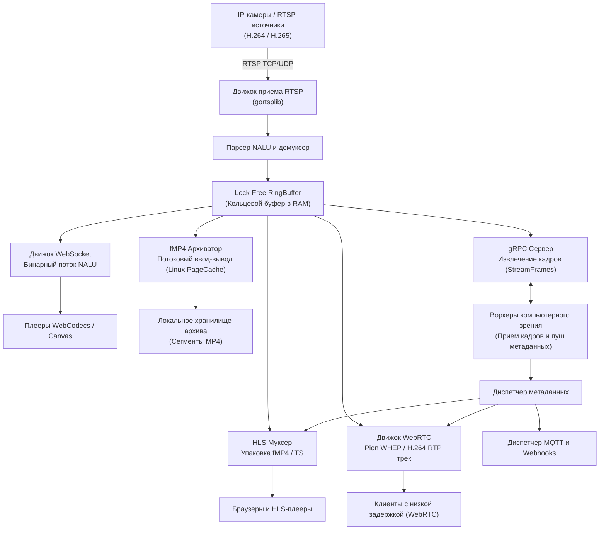

<p align="center">
  
</p>

<h1 align="center">RUSEON Core</h1>

<p align="center">
  <strong>Высокопроизводительная видеоинфраструктура и конвейер данных для систем ИИ</strong><br>
  Прием RTSP &bull; Трансмуксинг без блокировок в памяти &bull; HLS &bull; WebRTC (WHEP) &bull; fMP4 Архив &bull; gRPC Стриминг для ИИ
</p>

<p align="center">
  <a href="https://github.com/RUSEGAL/ruseon-core/actions/workflows/test.yml"></a>
  <a href="https://goreportcard.com/report/github.com/RUSEGAL/ruseon-core"></a>
  <a href="https://github.com/RUSEGAL/ruseon-core/releases/latest"></a>
  <a href="bench-results/bench-baseline.md"></a>
  <a href="LICENSE"></a>
</p>

<p align="center">
  <em>Читать на других языках: <a href="README.md">English</a>, <a href="README.ru.md">Русский</a>.</em>
</p>

---

## Что такое RUSEON?

**RUSEON Core** — это open-source платформа видеоинфраструктуры, разработанная на языке Go для парков IP-камер, периферийных вычислительных узлов (Edge) и конвейеров компьютерного зрения. Движок принимает видеопотоки H.264 и H.265 по протоколу RTSP (TCP/UDP) и мультиплексирует их напрямую в оперативной памяти в форматы HLS (fMP4/TS), WebRTC (WHEP), локальный fMP4 видеоархив и gRPC-потоки кадров для инференса нейросетей без выполнения серверного перекодирования (транскодинга).

Благодаря отказу от декодирования и повторного сжатия видео на сервере, RUSEON Core обеспечивает предсказуемое потребление ресурсов CPU и низкие накладные расходы на формирование плейлистов, выступая единым связующим мостом между оборудованием видеонаблюдения, веб-клиентами и моделями искусственного интеллекта.

---

## Почему RUSEON?

Традиционные медиасерверы либо ориентированы исключительно на ретрансляцию видео, либо требуют ресурсоемких конвейеров серверного транскодинга. RUSEON Core работает с видеопотоком как с непрерывным потоком структурированных данных:

* **Архитектура трансмуксинга (без транскодинга):** Видеопакеты парсятся на уровне NALU и перепаковываются в контейнеры, запрошенные клиентами (fMP4, TS, RTP), напрямую в памяти без декодирования и попиксельной обработки кадров.
* **Неблокирующее распределение через единый буфер:** Входящие кадры записываются один раз в ограниченный lock-free кольцевой буфер каждого потока. Все потребители (паковщик HLS, модуль WebRTC, архиватор fMP4, экстракторы кадров gRPC) читают данные из буфера конкурентно без создания дублирующих копий кадров в памяти.
* **Изоляция медленных клиентов (Slow Consumers):** Индивидуальные каналы чтения изолируют отстающих клиентов. Если потребитель не успевает считывать данные, кадры сбрасываются исключительно для этого клиента, не блокируя основной движок приема и других зрителей.
* **Управление дисковым кэшем ОС при потоковой записи:** Встроенный архиватор fMP4 оптимизирует дисковые операции на Linux через системные вызовы ядра (`posix_fadvise(FADV_DONTNEED)` и скользящее окно `sync_file_range`), предотвращая вымывание системного дискового кэша ОС (Page Cache) при непрерывной записи видео.
* **Отказоустойчивое встроенное состояние:** Конфигурация, метаданные камер и учетные записи пользователей сохраняются во встроенной NoSQL-СУБД BadgerDB с синхронным журналом предзаписи (`SyncWrites = true`), а при старте сервера выполняется восстановление незавершенных файлов архива (`RecoverCrashedFiles`).
* **Синхронизация метаданных ИИ:** Результаты инференса нейросетей (координаты детекций, телеметрия), поступающие по клиентским gRPC-потокам, синхронизируются с таймлайном видео и передаются клиентам через DataChannels в WebRTC и дорожки WebVTT в HLS.
* **Прозрачная эксплуатация:** Нативная поддержка метрик Prometheus, детерминированные пробы `/livez` и `/readyz`, отражающие реальную готовность подсистем, и структурированное JSON-логирование.

---

## Ключевые возможности

* **Прием RTSP:** Прием потоков H.264 и H.265 по TCP или UDP с ограничением конкурентных подключений и механизмом переподключения с джиттером.
* **Отдача HLS:** Потоковое вещание fMP4 и MPEG-TS с дедупликацией генерации master-плейлистов через singleflight и дорожками метаданных WebVTT.
* **WebRTC / WHEP:** Воспроизведение H.264 видео с субсекундной задержкой на базе движка Pion WebRTC через единый UDP-мультиплексор портов.
* **Низколатентный WebCodecs:** Передача бинарных NALU через WebSocket (`/stream/ws/:id`) для аппаратного рендеринга H.264 и H.265 на клиенте через WebCodecs и Canvas.
* **Архивация fMP4:** Непрерывная сегментированная запись во фрагментированный MP4 с автоматической очисткой по сроку хранения и таймлайн-индексацией.
* **gRPC-стриминг для ИИ:** Серверный стриминг видеокадров (`StreamFrames`) и клиентский стриминг для приема аналитических метаданных (`PushMetadata`).
* **Интеграция событий:** Отправка исходящих вебхуков с Circuit Breaker и публикация телеметрии в брокер MQTT через ограниченные очереди.
* **Встроенный дашборд:** Веб-интерфейс (React 19, TypeScript) для просмотра потоков, управления камерами и работы с таймлайном видеоархива.
* **Аутентификация и RBAC:** Контроль доступа на базе JWT с разделением ролей (Admin, Operator, Viewer, Service) для вызовов REST API и воспроизведения потоков.

---

## Архитектура

В RUSEON Core входящие RTSP-пакеты после демультиплексирования попадают в изолированный кольцевой буфер `RingBuffer`. Независимые воркеры конкурентно считывают кадры для обслуживания подключенных протоколов и модулей хранения.



Подробное описание архитектуры доступно в разделе [Архитектура и системный дизайн](https://docs.ruseon.tech/architecture/system).

---

## Результаты нагрузочного тестирования

Приведенные показатели получены в ходе непрерывного **8-часового стресс-теста на стабильность** при высокой конкурентной нагрузке на 12-ядерном хосте.

### Воспроизводимый базовый профиль (8 часов непрерывного теста)

| Подсистема | Метрика | Фактический результат | Эксплуатационные характеристики |
| :--- | :--- | :--- | :--- |
| **Входящий поток (Ingest)** | Суммарный FPS видео | **18 180.4 FPS** (1 342.9 Mbps) | 600 одновременных камер @ 30 FPS, `0` потерянных кадров (обработано 523.6 млн кадров) |
| **Отдача HLS** | Отдано сегментов | **501.9 MB/s** (17 625 404 сегмента) | 1 800 активных зрителей, передано `15.1 ТБ` (`p50: 3.59 ms`, `p95: 211.2 ms`) |
| **REST API Роутер** | Пропускная способность | **459.9 RPS** (13 244 819 запросов) | 10 воркеров, 100% OK (`0` ошибок, `p50: 0.59 ms`, `p95: 8.52 ms`, `p99: 28.74 ms`) |
| **WebRTC (WHEP)** | Поток RTP-пакетов | **2 439 152 пакета** (2.83 ГБ передано) | 240 одновременных пир-соединений, `0` ошибок сессий (`p50: 390.3 ms` хэндшейк) |
| **gRPC ИИ-конвейер** | Передача кадров и метаданных | **18 180.4 FPS** / **1 993.2 RPS** | 20 ИИ-воркеров, передано 523.6 млн кадров (`p50: 28.45 ms` задержка доставки) |
| **EventBus** | Доставка событий | **11 042 761 событие** | `0` потерянных событий зафиксировано в ходе данного теста |
| **Память процесса** | Системный футпринт | **707 MB RSS** (95 MB Heap Alloc) | 348 активных горутин на момент завершения (детерминированное освобождение воркеров) |
| **Сборка мусора (GC)** | Паузы рантайма Go | **1.03 ms средняя пауза** (пик 7.69 ms) | 154 969 циклов GC за 8 часов при сетевом трафике свыше 500 MB/s |

### Методология бенчмарка и область измерений

* **Конфигурация хоста:** 12-ядерный процессор (`num_cpu: 12`, архитектура x86_64).
* **Длительность теста:** 28 800.12 секунд (8.0 непрерывных часов).
* **Параметры нагрузки:** 600 синтетических RTSP-камер (720p @ 30 FPS, 2.24 Mbps на поток, GOP = 30), 1 800 HLS fMP4 плееров, 240 WebRTC WHEP сессий, 20 gRPC воркеров аналитики, 10 параллельных REST API воркеров.
* **Режим диска:** Стресс-тест выполнялся с эмуляцией дискового ввода-вывода (`real_disk: false`) для изоляции и измерения производительности CPU, RAM, сетевого стека и трансмуксинга независимо от лимитов физических дисковых массивов.
* **Совместное размещение (Co-Location):** Генератор нагрузки (`cmd/loadtest`) и сервер RUSEON Core работали совместно на одном 12-ядерном хосте через loopback (`127.0.0.1`), активно конкурируя за кванты планировщика ОС, пропускную способность памяти и сетевой стек ядра на протяжении всего теста.

👉 **[Полный отчет о нагрузочном тестировании и сырые данные](bench-results/bench-baseline.md)**

---

## Быстрый старт

### 1. Запуск в Docker

Запустите контейнер RUSEON Core с постоянными томами для данных и записей:

```bash
docker run -d \
  --name ruseon-core \
  -p 8080:8080 \
  -p 8555:8555/udp \
  -p 50051:50051 \
  -v ruseon_data:/app/data \
  -v ruseon_recordings:/app/recordings \
  ghcr.io/rusegal/ruseon-core:latest
```

При первом запуске RUSEON Core автоматически инициализирует базу данных, генерирует надежный пароль администратора и выводит его в журнал контейнера:

```bash
docker logs ruseon-core | grep "INITIAL ADMIN PASSWORD"
```

### 2. Вход в дашборд

Откройте адрес `http://localhost:8080` в браузере. Данные для входа:
* **Логин:** `admin`
* **Пароль:** *(Пароль, сгенерированный в логах контейнера)*

### 3. Добавление камеры через REST API

Потоки камер добавляются динамически без перезагрузки сервера:

```bash
# 1. Получение JWT-токена
TOKEN=$(curl -s -X POST http://localhost:8080/api/login \
  -H "Content-Type: application/json" \
  -d '{"username":"admin","password":"ВАШ_ПАРОЛЬ_АДМИНИСТРАТОРА"}' | jq -r .token)

# 2. Регистрация RTSP-потока камеры
curl -X POST http://localhost:8080/api/cameras \
  -H "Authorization: Bearer $TOKEN" \
  -H "Content-Type: application/json" \
  -d '{
    "id": "cam-front-door",
    "url": "rtsp://camera.local:554/live/ch0",
    "record": true,
    "retention_days": 7
  }'
```

---

## Системные требования

* **Целевая среда Production:** Linux (`amd64` / `arm64`), рекомендуется Kernel $\ge$ 5.4 для поддержки системных вызовов `sync_file_range` и `fadvise`.
* **Разработка и локальное тестирование:** macOS и Windows поддерживаются через стандартные драйверы файлового ввода-вывода.
* **Среда выполнения:** Docker $\ge$ 20.10, либо бинарный запуск (компиляция на Go $\ge$ 1.24).
* **Сетевые порты:**
  * `8080/tcp` — HTTP REST API, HLS-стриминг, сигнальный протокол WHEP, WebCodecs WebSocket, Web UI, Метрики.
  * `8555/udp` — мультиплексор медиапотоков WebRTC Pion (настраивается параметром `server.webrtc.listen_port`; если не задан, Pion использует стандартное динамическое выделение портов для ICE-кандидатов).
  * `50051/tcp` — интерфейс gRPC для ИИ-аналитики (настраивается параметром `server.grpc.port`).
* **Дисковая подсистема:** Рекомендуется выделенный SSD/NVMe при непрерывной записи 50+ параллельных потоков.

---

## Эксплуатация в Production

При развертывании RUSEON Core в промышленной среде рекомендуется следовать следующим практикам:

* **Постоянные тома:** Смонтируйте `/app/data` на надежный диск (хранилище BadgerDB). Смонтируйте `/app/recordings` на емкий массив, оптимизированный для последовательной записи.
* **Настройка WebRTC:** Задайте параметр `server.webrtc.nat_1_to_1_ips` с указанием внешнего IP-адреса хоста или балансировщика, и обеспечьте прямую доступность UDP-порта `8555` без симметричной трансляции NAT.
* **TLS и Reverse Proxy:** Завершайте TLS-соединения (HTTPS) на внешнем прокси (NGINX, Envoy, Traefik) или настройте TLS в `config.yaml`. Безопасный контекст (`https://`) является обязательным требованием браузеров для работы WebRTC.

Полное руководство по развертыванию доступно в [Руководстве по эксплуатации](https://docs.ruseon.tech/deployment/overview).

---

## Мониторинг и наблюдаемость (Observability)

RUSEON Core предоставляет стандартные интерфейсы для мониторинга и интеграции с системами оркестрации:

* **Проба живучести (`GET /livez`):** Подтверждает, что HTTP-сервер активен и обрабатывает сетевые запросы.
* **Проба готовности (`GET /readyz`):** Выполняет проверку доступности базы BadgerDB, прав записи в каталог видеоархива и состояния менеджера потоков. Возвращает `503 Service Unavailable`, если ключевые компоненты не готовы.
* **Метрики Prometheus (`GET /metrics`):** Экспорт метрик рантайма, битрейтов потоков, числа активных зрителей, потерь пакетов и дискового ввода-вывода.
* **Профилирование Go (`GET /debug/pprof/*`):** Доступ к профилированию рантайма (активируется параметром `server.pprof_port`).

---

## Модель безопасности

* **Аутентификация:** Все вызовы REST API и потоки защищены криптографически подписанными токенами HS256 JWT.
* **Хранение учетных записей:** Пароли пользователей хешируются с использованием bcrypt перед сохранением в BadgerDB.
* **Изоляция токенов:** Токены воспроизведения потоков (`?token=`) содержат клейм `stream_id` и строго изолированы от прав доступа к управляющему REST API.
* **Ролевая модель доступа (RBAC):** Эндпоинты API проверяют роли пользователей (`Admin`, `Operator`, `Viewer`, `Service`) через middleware.
* **Статический аудит:** Конвейер CI контролирует отсутствие замечаний `golangci-lint` и выполняет автоматическое сканирование уязвимостей через `gosec`.

Правила сообщения об уязвимостях описаны в [SECURITY.md](SECURITY.md).

---

## Совместимость и поддерживаемые стандарты

| Протокол / Компонент | Поддержка на приеме (Ingest) | Поддержка на отдаче (Clients) | Примечания |
| :--- | :--- | :--- | :--- |
| **RTSP** | H.264, H.265 (TCP / UDP) | — | Ограничение конкурентных подключений к источнику |
| **HLS** | — | fMP4, MPEG-TS | H.264 / H.265 сквозная передача; воспроизведение зависит от поддержки кодека клиентом/браузером |
| **WebRTC (WHEP)** | — | H.264 (`webrtc.MimeTypeH264`) | Субсекундное вещание через движок Pion WebRTC |
| **WebSocket** | — | Бинарный поток NALU | Клиентский плеер WebCodecs / HTML5 Canvas (H.264 и H.265) |
| **Хранилище архива** | — | Фрагментированный MP4 (fMP4) | Локальная файловая система с управлением кэшем POSIX |
| **Интеграция с ИИ** | `PushMetadata` (gRPC) | `StreamFrames` (gRPC) | Серверный стриминг кадров и клиентский прием метаданных |
| **IoT и события** | — | MQTT v3.1.1 / v5.0, Webhooks | Ограниченные асинхронные очереди с Circuit Breaker |
| **Встроенная база данных** | — | BadgerDB v4 | Pure Go LSM-дерево с WAL (`SyncWrites = true`) |

---

## Документация

Официальная документация проекта доступна по адресу **[docs.ruseon.tech](https://docs.ruseon.tech/)**:

* [Руководство по быстрому старту](https://docs.ruseon.tech/guide/introduction)
* [Справочник конфигурации](https://docs.ruseon.tech/reference/configuration)
* [Архитектура и потоки данных](https://docs.ruseon.tech/architecture/overview)
* [Настройка стриминга и WebRTC](https://docs.ruseon.tech/streaming/overview)
* [Архивация и подсистема Smart I/O](https://docs.ruseon.tech/archive/overview)
* [Спецификация REST API](https://docs.ruseon.tech/api/overview)
* [Развертывание в Production](https://docs.ruseon.tech/deployment/overview)
* [Диагностика и устранение неполадок](https://docs.ruseon.tech/troubleshooting/overview)

---

## Известные ограничения

* **Отсутствие серверного перекодирования:** RUSEON Core работает исключительно по принципу трансмуксинга без декодирования видео. Если камеры вещают в кодеках, не поддерживаемых браузером клиента (например, H.265 в старых мобильных браузерах), воспроизведение выполняется через встроенный клиентский плеер WebCodecs/Canvas либо требует внешнего транскодера.
* **Кодек отдачи WebRTC:** Отдача видео по WebRTC WHEP в текущей реализации поддерживает упаковку треков H.264. Потоки, принятые в H.265, могут воспроизводиться через HLS, WebSocket/WebCodecs или архивироваться в fMP4, но для вещания через WebRTC WHEP требуется входной поток H.264.
* **Локальное дисковое хранилище:** Редакция Community Edition предназначена для работы с локальными дисками и массивами хоста. Интерфейсы хранилища (`BlobStore`, `StateStore`) формируют границы абстракции для будущих распределенных бэкендов.
* **Ограниченные очереди метаданных:** Очереди публикации метаданных ИИ и сообщений MQTT являются ограниченными. При зависании внешних потребителей или брокеров переполненные очереди сбрасывают новые метаданные во избежание блокировки основного видеопотока.

Дополнительные детали описаны в разделе [Известные ограничения](https://docs.ruseon.tech/reference/known-limitations).

---

## Статус проекта и коммерческая поддержка

RUSEON Core Community Edition — это проект с открытым исходным кодом, распространяемый под лицензией MIT.

Архитектура проекта определяет интерфейсы (такие как `BlobStore` и `StateStore`), рассчитанные на интеграцию дополнительных бэкендов хранения, аутентификации и отказоустойчивости. Коммерческие расширения и корпоративные внедрения развиваются отдельно.

> По вопросам коммерческого внедрения, лицензирования и корпоративной поддержки: [rusegal.dev@yahoo.com](mailto:rusegal.dev@yahoo.com)

---

## Участие в разработке (Contributing)

Мы приветствуем вклад сообщества в развитие проекта:

1. Ознакомьтесь с [CONTRIBUTING.ru.md](CONTRIBUTING.ru.md) перед началом работы (целевая ветка разработки — `dev`).
2. Соблюдайте [Кодекс поведения (Code of Conduct)](CODE_OF_CONDUCT.md).
3. Убедитесь, что все тесты и статические анализаторы проходят успешно:
   ```bash
   go test -v -race ./...
   golangci-lint run ./...
   ```

---

## Лицензия

RUSEON Core (Community Edition) распространяется под лицензией [MIT License](LICENSE).
