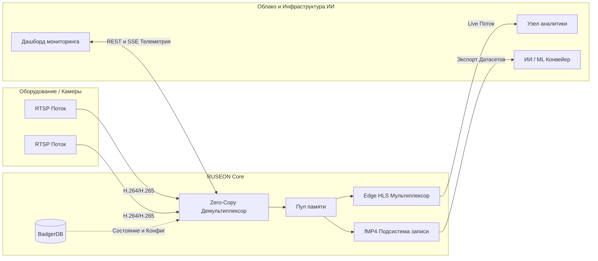

<p align="center">
  
</p>

<h1 align="center">RUSEON Core</h1>

<p align="center">
  <strong>Edge Video Infrastructure & AI Data Pipeline</strong><br>
  <em>Облачно-ориентированная, высокопроизводительная платформа для видеоданных</em>
</p>

<p align="center">
  <a href="https://github.com/RUSEON/ruseon-core/actions/workflows/ci.yml"></a>
  <a href="https://goreportcard.com/report/github.com/RUSEON/ruseon-core"></a>
  <a href="https://github.com/RUSEON/ruseon-core/releases/latest"></a>
  
  
</p>

<p align="center">
  <em>Читать на других языках: <a href="README.md">English</a>, <a href="README.ru.md">Русский</a>.</em>
</p>

<hr>

**RUSEON Core** (Community Edition) — это современная Enterprise-платформа для работы с видеоданными, написанная на Go. Разработанная для облачных и Edge-инфраструктур, она обеспечивает zero-copy ретрансляцию RTSP в HLS, высокопроизводительную запись видеоархива в формате fMP4 и бесшовный конвейер для систем видеоаналитики и ИИ.

Созданный для масштабирования, RUSEON Core обеспечивает колоссальную пропускную способность при минимальном потреблении ресурсов, что делает его идеальным фундаментом для корпоративных сетей видеонаблюдения, систем «умного города» и конвейеров данных для ИИ.

## 🚀 Ключевые возможности

* ⚡ **Zero-Copy Ретрансляция**: Сверхнизкая задержка при преобразовании RTSP в HLS напрямую в оперативной памяти. Обходит промежуточное перекодирование для максимальной эффективности.
* 🛡 **Cloud-Native Надежность**: Встроенная защита от проблемы "Thundering Herd" и надежное управление памятью (OOM-контроль) для безопасной работы с тысячами одновременных потоков.
* 📦 **Высокопроизводительный архив (fMP4)**: Непрерывная запись без потерь в формат fragmented MP4. Оптимизировано для хранения на Edge-устройствах и быстрой синхронизации с облаком.
* ⏪ **Продвинутый Timeshift-конвейер**: Воспроизведение архивных данных в формате HLS в реальном времени с возможностью бесшовного экспорта датасетов для обучения ИИ.
* 🗄 **Встроенная NoSQL-СУБД**: Работает на базе BadgerDB, обеспечивая субмиллисекундное сохранение конфигураций и метрик без необходимости во внешних зависимостях.
* 🎨 **Современный UI-мониторинг**: Включает Edge-дашборд на React 19 (TypeScript) с JWT-авторизацией, телеметрией SSE в реальном времени и удобной визуализацией таймлайна.

---

## 🏗 Архитектура и Конвейер Данных ИИ

RUSEON Core выступает в роли критически важного связующего звена между Edge-оборудованием и вашими Облачными/ИИ нагрузками.



---

## 🏎 Быстрый старт

### Требования
- [Docker](https://www.docker.com/) (Рекомендуется для быстрого развертывания)
- [Go](https://go.dev/) 1.23+ (Для сборки из исходников)

### Развертывание через Docker (GHCR) 🐳

Самый быстрый способ развернуть RUSEON Core — использовать наш официальный multi-arch Docker-образ:

```bash
docker run -d \
  -p 8080:8080 \
  -v ruseon-data:/data \
  --name ruseon-core \
  ghcr.io/ruseon/ruseon-core:latest
```

Корпоративный Edge-дашборд будет доступен по адресу `http://localhost:8080`.

### Сборка из исходников

Для разработчиков и контрибьюторов:

```bash
# 1. Клонирование репозитория
git clone https://github.com/RUSEON/ruseon-core.git
cd ruseon-core

# 2. Сборка Edge-дашборда (React)
cd web && npm install && npm run build && cd ..

# 3. Запуск ядра (Core Engine)
go mod tidy
go run ./cmd/server
```
*(Учетные данные по умолчанию: admin / admin)*

---

## 🤝 Участие в разработке

Мы верим в силу open-source и приветствуем любой вклад от сообщества.
Будь то баг-репорт, новая фича или улучшение документации, пожалуйста, ознакомьтесь с нашим [Руководством для контрибьюторов](CONTRIBUTING.ru.md) для начала работы.

Убедитесь, что ваши коммиты соответствуют спецификации [Conventional Commits](https://www.conventionalcommits.org/).

## 📄 Лицензия

RUSEON Core (Community Edition) распространяется под лицензией [MIT](LICENSE).
